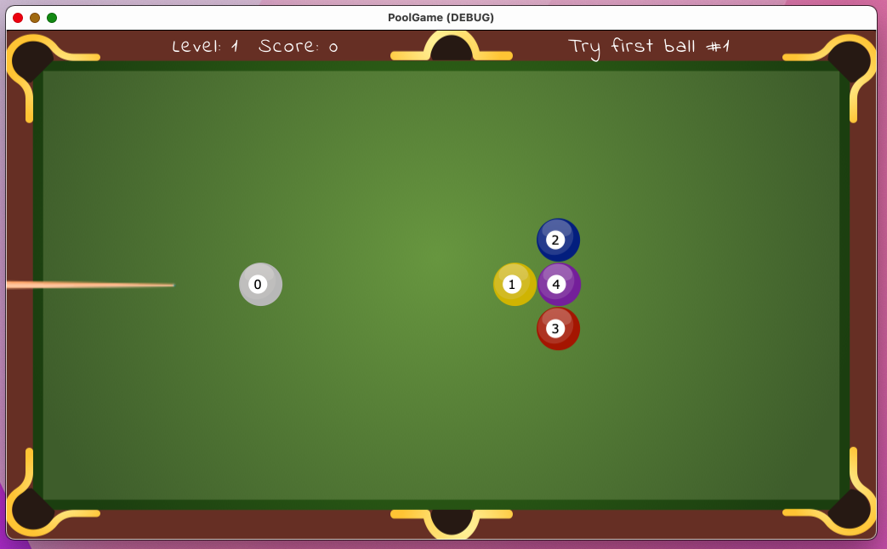

# Juego Mesa de Billar 2D
Godot Billiards / Pool 2D Game

Didactic example applying Game Physics 2D for a "Game Platforms" course (UACH)

## How to play 
- Watch at the score bar which ball must fall first to maximize your score, e.g. ball #1 in example screenshot image 
- Always hit ball zero: click first near ball and drag the cue to define your shot force & angle. Second click to shot
- Caution: if cue-impulse if too much balls may drop out of the table (negative score).
- After one ball falls, try to drop the ball with the smaller number first to gain more points.
- Special keys:
  - Enter or space bar: pause the game
  - Escape key: to exit, reset or pause the game

### @todo:
 - Mobile version
